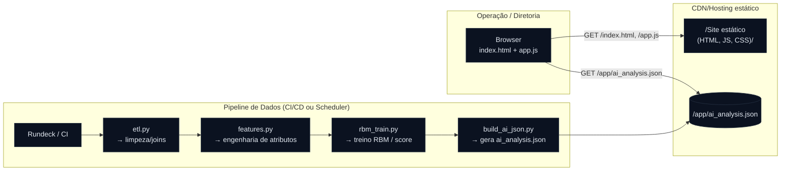

# Rundeck AI – Painel de Falhas × Alto Tempo (RBM)

Painel estático para **leitura operacional** de riscos em jobs (Rundeck): combina **falha** e **alto tempo** de execução, priorizando hotspots e amostras com maior probabilidade de problema.  
**Fonte de dados:** `./app/ai_analysis.json` servido no **mesmo domínio** do site (same‑origin).

---

## 📐 Arquitetura (visão de ponta a ponta)



**Fluxo:**  
1) O **Pipeline** (Rundeck/CI) processa dados históricos, treina/aplica RBM e **gera `ai_analysis.json`** dentro de `/app/`.  
2) O **Hosting estático** publica o site (index.html, app.js) e o JSON no **mesmo domínio**.  
3) O **Browser** faz `fetch('./app/ai_analysis.json')` e renderiza KPIs, gráficos e tabelas.

> Sem dependência de S3 público. O JSON é empacotado e servido pelo próprio hosting do site.

---

## 🧠 RBM (Restricted Boltzmann Machine) – como usamos

**Objetivo:** dar um **score de “estranheza”** para execuções de jobs combinando sinais (duração, horário, tipo de falha, sazonalidade, etc.). Itens com **erro de reconstrução** maior que um limiar sugerem **anomalia**.

### 1) Intuição
Uma RBM modela distribuição de probabilidade de um vetor de entrada \( \mathbf{v} \) (**visível**) via unidades **ocultas** \( \mathbf{h} \). A RBM aprende padrões “normais”. Quando recebe uma entrada que **não se parece** com o que aprendeu, o **erro de reconstrução** aumenta.

### 2) Equações essenciais
- Energia do par \((\mathbf{v}, \mathbf{h})\):  
  \[ E(\mathbf{v},\mathbf{h}) = -\mathbf{b}^\top \mathbf{v} - \mathbf{c}^\top \mathbf{h} - \mathbf{v}^\top W \mathbf{h} \]
- Ativações condicionais (Bernoulli):
  \[ p(h_j=1|\mathbf{v}) = \sigma(c_j + W_{:,j}^\top \mathbf{v}), \quad
     p(v_i=1|\mathbf{h}) = \sigma(b_i + W_{i,:}\mathbf{h}) \]
- **Erro de reconstrução** (métrica prática):  
  \[ \text{RE}(\mathbf{v}) = \|\mathbf{v} - \hat{\mathbf{v}}\|_2^2 \]  
  onde \( \hat{\mathbf{v}} \) é a reconstrução após uma etapa Gibbs.

### 3) Pipeline de análise (alto nível)
1. **ETL (`etl.py`)**: agrega execuções (job, projeto, status, duração_s, data/hora, etc.).  
2. **Features (`features.py`)**: normaliza/one‑hot e cria atributos úteis (hora do dia, dia da semana, p95 histórico, desvio vs. média, sazonalidade).  
3. **Treino/Score (`rbm_train.py`)**: usa `sklearn.neural_network.BernoulliRBM` para treinar em histórico **saudável** (ou com rótulos filtrados). Gera **erro de reconstrução** por execução.  
4. **Risco combinado (`build_ai_json.py`)**: consolida métricas por job (média, p95, contagem de eventos cruzados falha×alto tempo) e produz `ai_analysis.json`.

### 4) Como o painel decide “hotspots”
- **Eventos cruzados**: contagem de execuções com **falha** e **duração acima do p95** (mesmo job).  
- **Risco p95 por job**: para cada job, calcula p95 de duração e exibe junto à média.  
- **Top amostras**: ordena execuções com maior score (erro de reconstrução) e evidencia as piores.

> Você pode calibrar limiares (ex.: percentil 95 do **RE**) ou usar métodos como **IQR** para “outlier score”.

---

## 📄 Esquema do `ai_analysis.json` (mínimo)

```json
{
  "meta": { "modelo": "BernoulliRBM", "periodo": "último trimestre", "gerado_em": "YYYY-MM-DDThh:mm:ssZ" },
  "resumo": {
    "registros": 2500,
    "falhas": 87,
    "alto_tempo": 42,
    "eventos_cruzados": 19,
    "taxa_cruzada": 0.34,
    "phi": 0.21,
    "lift": 1.8
  },
  "hotspots": [
    { "projeto": "core", "job": "daily_settlement", "eventos": 12, "risco_medio": 0.73, "risco_p95": 0.92, "duracao_media_s": 410 }
  ],
  "risco_p95_por_job": [
    { "job": "daily_settlement", "p95": 732, "duracao_media": 410 }
  ],
  "top_amostras": [
    { "projeto": "core", "job": "daily_settlement", "exec_id": "abc", "inicio": "2025-09-17T10:00:00Z", "status": "FAILED", "duracao_s": 930, "risco": 0.92 }
  ]
}
```

**Observações**
- Evite `NaN`, `Infinity` e comentários no JSON.  
- Números com vírgula (`"0,9"`) são tolerados no front, mas prefira ponto decimal.

---

## 🛠️ Scripts (exemplos de referência)

### `etl.py` (pseudo‑código)
```python
import pandas as pd

df = pd.read_csv("execucoes.csv")  # colunas: projeto, job, inicio, status, duracao_s, ...
# limpeza/normalização
df = df.dropna(subset=["job", "duracao_s"]).copy()
df["duracao_s"] = df["duracao_s"].astype(float)
df.to_parquet("stage/execucoes.parquet", index=False)
```

### `features.py`
```python
import pandas as pd
import numpy as np

df = pd.read_parquet("stage/execucoes.parquet")
df["inicio"] = pd.to_datetime(df["inicio"])
df["hora"] = df["inicio"].dt.hour
df["dow"]  = df["inicio"].dt.dayofweek
# p95 histórico por job
p95 = df.groupby("job")["duracao_s"].quantile(0.95).rename("p95_job")
feat = df.join(p95, on="job")
feat["ratio_p95"] = feat["duracao_s"] / np.maximum(feat["p95_job"], 1.0)
# one-hot simples
feat = pd.get_dummies(feat, columns=["status","dow","hora"], drop_first=True)
feat.to_parquet("stage/features.parquet", index=False)
```

### `rbm_train.py` (score por execução)
```python
import pandas as pd
import numpy as np
from sklearn.neural_network import BernoulliRBM
from sklearn.preprocessing import MinMaxScaler

X = pd.read_parquet("stage/features.parquet").select_dtypes(include=[np.number]).fillna(0.0).values
sc = MinMaxScaler()
Xn = sc.fit_transform(X)

rbm = BernoulliRBM(n_components=64, learning_rate=0.05, batch_size=64, n_iter=30, verbose=True)
rbm.fit(Xn)

# reconstrução
H = rbm.transform(Xn)              # p(h=1|v)
V_hat = rbm.gibbs(H)               # reconstrução aproximada
re = ((Xn - V_hat) ** 2).sum(axis=1)  # erro L2

pd.DataFrame({"re": re}).to_parquet("stage/score.parquet", index=False)
```

### `build_ai_json.py` (consolidação e JSON final)
```python
import json, numpy as np, pandas as pd

execs = pd.read_parquet("stage/execucoes.parquet")
score = pd.read_parquet("stage/score.parquet")
df = execs.join(score)

# eventos cruzados: falha & acima do p95 do próprio job
p95 = df.groupby("job")["duracao_s"].quantile(0.95).rename("p95_job")
df = df.join(p95, on="job")
df["alto_tempo"] = df["duracao_s"] > df["p95_job"]
df["falhou"] = df["status"].ne("SUCCESS")

eventos_cruz = df.loc[df["alto_tempo"] & df["falhou"]]

hot = (eventos_cruz.groupby(["projeto","job"])
       .agg(eventos=("job","count"),
            risco_medio=("re","mean"),
            risco_p95=("re",lambda s: float(np.percentile(s,95))),
            duracao_media_s=("duracao_s","mean"))
       .reset_index()
       .sort_values("eventos", ascending=False)
       .head(20))

risco_job = (df.groupby("job")
             .agg(p95=("duracao_s", lambda s: float(np.percentile(s,95))),
                  duracao_media=("duracao_s","mean"))
             .reset_index())

top = (df.sort_values("re", ascending=False)
       .head(50)[["projeto","job","exec_id","inicio","status","duracao_s"]]
       .assign(risco=lambda x: x.index.map(lambda i: float(df.loc[x.index[i],"re"]))))

resumo = {
  "registros": int(len(df)),
  "falhas": int(df["falhou"].sum()),
  "alto_tempo": int(df["alto_tempo"].sum()),
  "eventos_cruzados": int(len(eventos_cruz)),
  "taxa_cruzada": round(len(eventos_cruz)/max(1,len(df)), 3),
  "phi": round(float(df["falhou"].mean() * df["alto_tempo"].mean()), 3),  # proxy simples
  "lift": round(float((df["falhou"] & df["alto_tempo"]).mean() / max(1e-6, df["falhou"].mean())), 2)
}

out = {
  "meta": { "modelo": "BernoulliRBM", "periodo": "último trimestre" },
  "resumo": resumo,
  "hotspots": hot.to_dict(orient="records"),
  "risco_p95_por_job": risco_job.to_dict(orient="records"),
  "top_amostras": top.to_dict(orient="records")
}

with open("app/ai_analysis.json","w",encoding="utf-8") as f:
  json.dump(out, f, ensure_ascii=False, indent=2)
```

---

## 🚀 Front-end (same‑origin)

- **Busca**: `new URL('./app/ai_analysis.json?ts=' + Date.now(), document.baseURI)`  
- **Cache**: `cache: 'no-store'` + header `Cache-Control: no-cache` no hosting.  
- **Resiliência**: sanitização de números (“0,9”), tolerância a chaves `snake_case`/`camelCase`.

**Rewrites/Redirects (ordem importa)**  
1. `source: /app/<*>  →  target: /app/<*>  (200 Rewrite)`  
2. `source: /<*>      →  target: /index.html  (200 Rewrite)`

**Custom headers**  
- `Source: /app/*.json`  
  `Content-Type: application/json`  
  `Cache-Control: no-cache`

---

## 🔧 Instalação & Build (sem bundler)

**Estrutura mínima**:
```
/app
  ├─ index.html
  ├─ app.js
  └─ app/
     └─ ai_analysis.json
```

**Build simples** (copia /app → artifact):
```yaml
version: 1
frontend:
  phases:
    build:
      commands:
        - rm -rf webout && mkdir -p webout
        - cp -r app/* webout/
  artifacts:
    baseDirectory: webout
    files:
      - '**/*'
```

Se usar Node/bundler dentro de `/app`, adicione `npm ci && npm run build` e publique `dist/` ou `build/` conforme seu toolchain.

---

## 🩺 Troubleshooting

- **“Erro ao carregar dados”** no painel → abra DevTools/Network e verifique `/app/ai_analysis.json`:
  - **Preview mostra HTML** → a regra `/app/<*>` está **abaixo** da SPA; ajuste a ordem.
  - **404** → o JSON não foi incluído no artifact (copie `app/ai_analysis.json` no build).
  - **Content-Type** incorreto → configure `application/json`.
  - **JSON inválido** (`NaN`, vírgulas finais, comentários) → valide antes de publicar.

- **Gráfico trava** → sanitização já inclusa no `app.js`; ainda assim, normalize números no JSON.

---

## ✅ Boas práticas

- Treinar RBM em período considerado **saudável** (ou com filtros).  
- Atualizar o JSON pelo menos **1×/dia** (ou por janela operacional).  
- Versionar `ai_analysis.json` para auditoria (timestamp em `meta.gerado_em`).  
- Acompanhar **tendências**: queda/subida sistemática do p95 e do erro médio por job.

---

## 📜 Licença

Uso interno. Ajuste conforme sua política.
