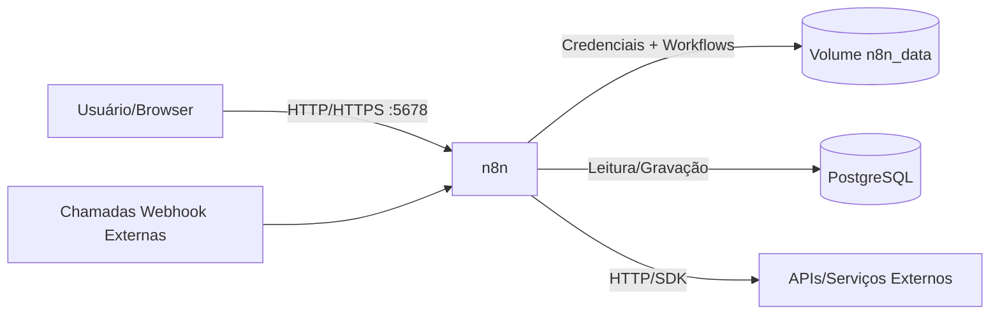

# POC n8n – README

Este README descreve como **subir uma POC do n8n** em Ubuntu 24.04 usando Docker, a **arquitetura proposta (Mermaid)**, scripts iniciais, variáveis de ambiente e **passo a passo** para configurar o n8n pela interface gráfica.

---

## 1) Objetivo e escopo
- Subir o n8n localmente (localhost) de forma segura o suficiente para POC.
- Persistência em **PostgreSQL** (recomendado) e volume local para dados do n8n.
- Fluxo de exemplo: **Webhook → Function/HTTP → Respond** (ecoar/transformar payload e opcionalmente chamar API externa).
- Sem balanceamento de carga nem HA (escopo de POC).

---

## 2) Arquitetura (Mermaid)

**Notas**
- `n8n_data` guarda assets/configs do app (inclui credenciais criptografadas).
- Banco **PostgreSQL** recomendado para estabilidade; SQLite é possível, mas apenas para testes mínimos.

---

## 3) Pré‑requisitos
- Ubuntu 24.04 com Docker + Compose v2 (ex.: `docker --version` e `docker compose version`).
- Porta **5678** livre.
- Acesso à internet para baixar imagens Docker.

> Caso ainda não tenha Docker/Compose, instale (resumo):
> ```bash
> sudo apt-get update && sudo apt-get install -y ca-certificates curl gnupg
> curl -fsSL https://download.docker.com/linux/ubuntu/gpg | sudo gpg --dearmor -o /etc/apt/keyrings/docker.gpg
> echo "deb [arch=$(dpkg --print-architecture) signed-by=/etc/apt/keyrings/docker.gpg] https://download.docker.com/linux/ubuntu noble stable" | sudo tee /etc/apt/sources.list.d/docker.list > /dev/null
> sudo apt-get update
> sudo apt-get install -y docker-ce docker-ce-cli containerd.io docker-buildx-plugin docker-compose-plugin
> sudo systemctl enable --now docker
> sudo groupadd docker 2>/dev/null || true
> sudo usermod -aG docker $USER
> newgrp docker
> ```

---

## 4) Estrutura de arquivos do projeto
```
./poc-n8n/
├─ .env                  # variáveis de ambiente (edite!)
├─ compose.yaml          # docker compose do n8n + postgres
├─ start.sh              # sobe o ambiente
├─ stop.sh               # derruba o ambiente
├─ logs.sh               # segue logs do n8n
├─ backup.sh             # backup do PostgreSQL
├─ restore.sh            # restore para PostgreSQL
└─ README_POC_n8n.md     # este guia
```

Crie a pasta do projeto e entre nela:
```bash
mkdir -p ~/poc-n8n && cd ~/poc-n8n
```

---

## 5) Arquivos – conteúdo sugerido

### 5.1) `.env` (modelo)
> **Edite as senhas/chaves antes de iniciar**
```
# ======= n8n =======
N8N_HOST=localhost
N8N_PORT=5678
N8N_PROTOCOL=http
WEBHOOK_URL=http://localhost:5678/
GENERIC_TIMEZONE=America/Sao_Paulo

# Segurança básica (POC). Em produção, prefira SSO/reverso-proxy TLS.
N8N_BASIC_AUTH_ACTIVE=true
N8N_BASIC_AUTH_USER=admin
N8N_BASIC_AUTH_PASSWORD=troque_me

# Criptografia de credenciais do n8n (gere algo grande/aleatório!)
N8N_ENCRYPTION_KEY=troque_esta_chave_longa_e_aleatoria

# ======= PostgreSQL =======
POSTGRES_USER=n8n
POSTGRES_PASSWORD=troque_pg
POSTGRES_DB=n8ndb
```

### 5.2) `compose.yaml`
```yaml
services:
  postgres:
    image: postgres:16-alpine
    environment:
      - POSTGRES_USER=${POSTGRES_USER}
      - POSTGRES_PASSWORD=${POSTGRES_PASSWORD}
      - POSTGRES_DB=${POSTGRES_DB}
    healthcheck:
      test: ["CMD-SHELL", "pg_isready -U $$POSTGRES_USER -d $$POSTGRES_DB"]
      interval: 5s
      timeout: 5s
      retries: 10
    volumes:
      - postgres_data:/var/lib/postgresql/data

  n8n:
    image: n8nio/n8n:latest
    depends_on:
      postgres:
        condition: service_healthy
    ports:
      - "${N8N_PORT}:5678"
    environment:
      - N8N_HOST=${N8N_HOST}
      - N8N_PORT=${N8N_PORT}
      - N8N_PROTOCOL=${N8N_PROTOCOL}
      - WEBHOOK_URL=${WEBHOOK_URL}
      - GENERIC_TIMEZONE=${GENERIC_TIMEZONE}
      - N8N_BASIC_AUTH_ACTIVE=${N8N_BASIC_AUTH_ACTIVE}
      - N8N_BASIC_AUTH_USER=${N8N_BASIC_AUTH_USER}
      - N8N_BASIC_AUTH_PASSWORD=${N8N_BASIC_AUTH_PASSWORD}
      - N8N_ENCRYPTION_KEY=${N8N_ENCRYPTION_KEY}
      # DB Postgres
      - DB_TYPE=postgresdb
      - DB_POSTGRESDB_HOST=postgres
      - DB_POSTGRESDB_PORT=5432
      - DB_POSTGRESDB_DATABASE=${POSTGRES_DB}
      - DB_POSTGRESDB_USER=${POSTGRES_USER}
      - DB_POSTGRESDB_PASSWORD=${POSTGRES_PASSWORD}
    volumes:
      - n8n_data:/home/node/.n8n

volumes:
  n8n_data:
  postgres_data:
```

> **Opcional (fila com Redis para alta carga):** adicionar `redis:7-alpine` e apontar `N8N_QUEUE_BULL_REDIS_...`. Para POC simples, não é necessário.

### 5.3) `start.sh`
```bash
#!/usr/bin/env bash
set -euo pipefail

echo "[n8n] Subindo ambiente..."
docker compose up -d

echo "[n8n] Serviços ativos:"
docker compose ps

echo "[n8n] URL: http://localhost:${N8N_PORT:-5678}/"
```

### 5.4) `stop.sh`
```bash
#!/usr/bin/env bash
set -euo pipefail

echo "[n8n] Derrubando ambiente..."
docker compose down
```

### 5.5) `logs.sh`
```bash
#!/usr/bin/env bash
set -euo pipefail

docker compose logs -f n8n
```

### 5.6) `backup.sh` (PostgreSQL)
```bash
#!/usr/bin/env bash
set -euo pipefail

TS=$(date +%Y%m%d_%H%M%S)
mkdir -p backups

echo "[n8n] Backup do PostgreSQL..."
docker compose exec -T postgres pg_dump -U ${POSTGRES_USER:-n8n} -d ${POSTGRES_DB:-n8ndb} | gzip > backups/n8n_pg_${TS}.sql.gz

echo "[n8n] Arquivo: backups/n8n_pg_${TS}.sql.gz"
```

### 5.7) `restore.sh` (PostgreSQL)
```bash
#!/usr/bin/env bash
set -euo pipefail

FILE="$1"
if [[ -z "${FILE}" ]]; then
  echo "Uso: $0 backups/n8n_pg_YYYYmmdd_HHMMSS.sql.gz"; exit 1; fi

echo "[n8n] Restaurando '${FILE}'..."
gunzip -c "${FILE}" | docker compose exec -T postgres psql -U ${POSTGRES_USER:-n8n} -d ${POSTGRES_DB:-n8ndb}

echo "[n8n] Restore concluído."
```

> Dê permissão de execução: `chmod +x start.sh stop.sh logs.sh backup.sh restore.sh`

---

## 6) Subindo o ambiente
```bash
# dentro de ~/poc-n8n
./start.sh
# ver logs
./logs.sh
```
Acesse **http://localhost:5678** (se habilitou Basic Auth, use usuário/senha do `.env`).
No primeiro acesso, o n8n solicita criar o **Owner** (admin da instância). Conclua o onboarding.

---

## 7) Configuração inicial via UI (passo a passo)
1. **Timezone**: Settings → *Personal* → *Preferences* → defina `America/Sao_Paulo`.
2. **Instance URL** (opcional, mas recomendado): Settings → *General* → *Instance URL*: `http://localhost:5678/`. Isso garante webhooks corretos.
3. **Retention de execuções**: Settings → *General* → *Execution data*: habilite prune (ex.: 14 dias) para evitar crescimento do banco.
4. **Credenciais**: Menu *Credentials* → crie tokens de APIs que pretende usar (ex.: Slack, GitHub, HTTP Basic, Postgres, SMTP). As chaves ficam **criptografadas** pela `N8N_ENCRYPTION_KEY`.

---

## 8) Primeiro workflow (exemplo: Webhook → Function → Respond)
**Objetivo**: Receber JSON, enriquecer com timestamp e devolver resposta.

1. **Create** → *New Workflow* → nomeie: `POC – Webhook echo`.
2. **Node 1: Webhook**
   - *HTTP Method*: `POST`
   - *Path*: `poc/demo` → seu endpoint será:
     - **Teste**: `http://localhost:5678/webhook-test/poc/demo`
     - **Produção**: `http://localhost:5678/webhook/poc/demo`
   - Clique **Execute Workflow** (modo de teste).
3. **Node 2: Function** (arraste e conecte do Webhook)
   - Código (JavaScript):
     ```js
     // Lê o JSON recebido e acrescenta timestamp
     const payload = $json;
     return [{
       received: payload,
       ts: new Date().toISOString(),
       note: "Olá, n8n!"
     }];
     ```
4. **Node 3: Respond to Webhook**
   - *Response Mode*: `On Received` (ou `Last Node` se preferir responder o output da Function)
   - *Response Data*: `JSON`
   - Conecte a saída da Function para este node.
5. **Testar (modo teste)**:
   ```bash
   curl -X POST "http://localhost:5678/webhook-test/poc/demo" \
     -H "Content-Type: application/json" \
     -d '{"message":"hello"}'
   ```
   Deve retornar o JSON com `received`, `ts` e `note`.
6. **Produção**: clique **Activate** (toggle no topo). Use:
   ```bash
   curl -X POST "http://localhost:5678/webhook/poc/demo" \
     -H "Content-Type: application/json" \
     -d '{"message":"prod"}'
   ```

> **Extensões**: adicione um node **HTTP Request** para chamar uma API externa ou um node **Slack**/**Email** para notificação.

---

## 9) Boas práticas (POC → Prod)
- **Segurança**: manter `N8N_ENCRYPTION_KEY` forte/secreta; ativar autenticação; publicar atrás de **reverse proxy** com TLS (Caddy/Traefik/Nginx) e IP allow‑list se possível.
- **Backups**: rode `./backup.sh` em cron (ex.: diário); versionar `compose.yaml`/`.env` com cuidado (nunca commitar segredos!).
- **Observabilidade**: exporte logs (`./logs.sh`), considere métricas/saúde via reverse proxy.
- **Fila/escala**: para alta carga, habilitar **Redis** e modo fila; separar banco gerenciado.

---

## 10) Troubleshooting rápido
- **Porta 5678 ocupada**: ajuste `N8N_PORT` no `.env` e refaça `./start.sh`.
- **Loop de restart do n8n**: ver `./logs.sh`; valide conexão ao Postgres e `N8N_ENCRYPTION_KEY` imutável.
- **Permissões de volume**: apague volumes e suba novamente (em POC) ou ajuste dono/UID.
- **Webhooks não respondem**: confirme *Instance URL* e PATH do node Webhook; em teste use `/webhook-test/...`.

---

## 11) Próximos passos
- Criar credenciais (Slack, GitHub, Postgres, SMTP) e montar fluxos reais (ETL leve, alertas, integrações).
- Se necessário, adicionar **Redis** e proxy HTTPS.
- Versionar *workflows* exportados (`.json`) num repositório Git privado.

